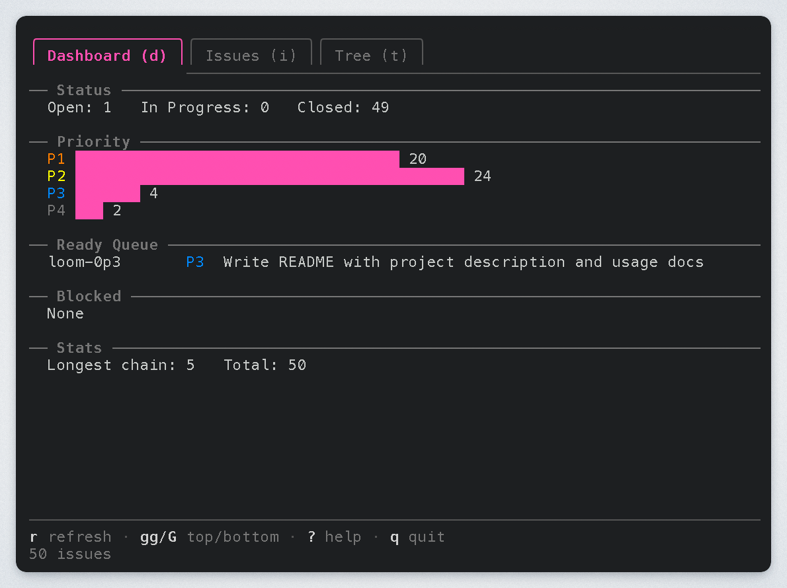
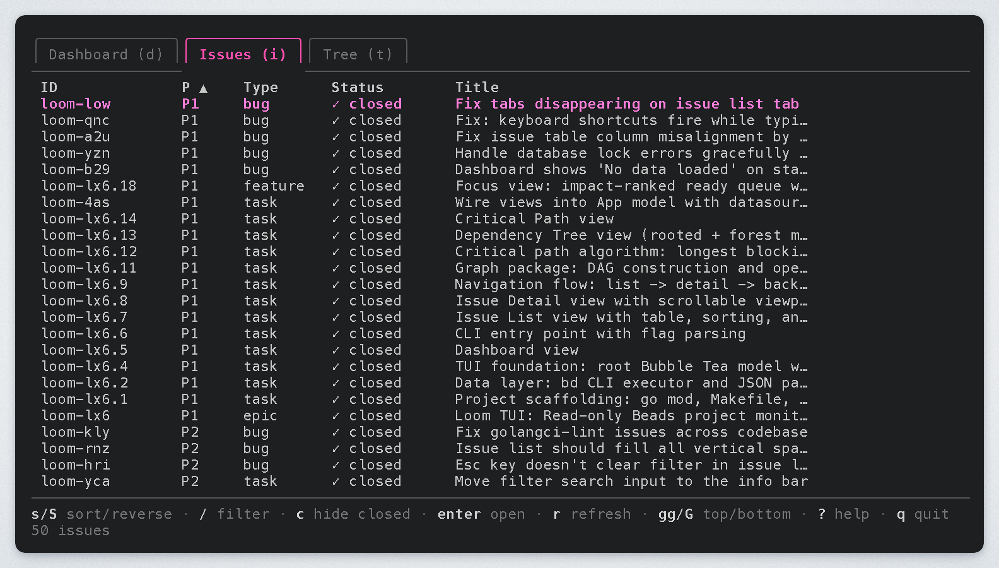
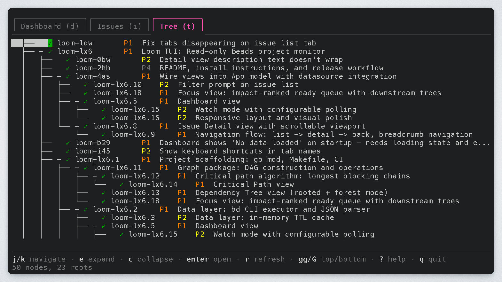
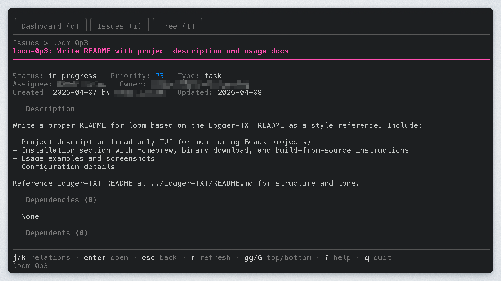

# Loom

Loom is a terminal user interface for exploring and visualizing issue
dependencies in the [Beads](https://github.com/gastownhall/beads) issue
tracking system. Browse issues, trace dependency chains, and monitor project
health — all from a keyboard-driven TUI that stays out of your way.

## Installation

### Homebrew

```bash
brew install grantlucas/tap/loom
```

### Download Binary

Download a pre-built binary from the
[GitHub Releases](https://github.com/grantlucas/loom/releases) page.

Builds are available for Linux, macOS, and Windows on both amd64 and arm64.

### Build from Source

```bash
git clone https://github.com/grantlucas/loom.git
cd loom
make build
```

The binary is written to `bin/loom`.

## Usage

```bash
loom                              # Launch with defaults
loom --watch                      # Auto-refresh on an interval
loom --watch --interval 10s       # Custom refresh interval
loom --beads-dir /path/to/.beads  # Point to a specific project
```

<!-- markdownlint-disable MD013 -->
| Flag           | Description                              | Default  |
|----------------|------------------------------------------|----------|
| `--watch`      | Start in watch mode (auto-refresh)       | off      |
| `--interval`   | Polling interval for watch mode          | `5s`     |
| `--beads-dir`  | Path to `.beads` directory               | `.beads` |
| `--version`    | Print version and exit                   |          |
<!-- markdownlint-enable MD013 -->

## Views

### Dashboard (`d`)

A project health overview showing status counts, priority distribution, the
ready queue, blocked issues, and dependency chain stats.



### Issues (`i`)

An interactive table of all issues. Sort by column with `s`, reverse with `S`,
and filter with `/`:

```text
status:open       Filter by status
priority:1        Filter by priority
type:task         Filter by issue type
assignee:name     Filter by assignee
coffee            Free-text search in title and ID
```

Press `c` to toggle closed issue visibility.



### Tree (`t`)

An ASCII dependency tree showing the full issue hierarchy. Expand and collapse
nodes with `e` and `c` to focus on the chains that matter.



### Detail (Enter)

Open any issue to see its full description, metadata, and dependency
relationships. Navigate between related issues with `j`/`k` and Enter.



## Keyboard Shortcuts

<!-- markdownlint-disable MD013 -->
| Key        | Action                                |
|------------|---------------------------------------|
| `d`        | Dashboard view                        |
| `i`        | Issues view                           |
| `t`        | Tree view                             |
| Enter      | Open detail / follow relation         |
| Esc        | Back                                  |
| `j` / `k`  | Move down / up                        |
| `gg` / `G` | Jump to top / bottom                  |
| `/`        | Filter (Issues view)                  |
| `s` / `S`  | Sort / reverse sort (Issues view)     |
| `r`        | Refresh data                          |
| `w`        | Toggle watch mode                     |
| `?`        | Toggle help panel                     |
| `q`        | Quit                                  |
<!-- markdownlint-enable MD013 -->

## Prerequisites

Loom reads from a Beads project, so you need
[beads](https://github.com/gastownhall/beads) installed and a project
initialized (`bd init`) before launching.

## Related Projects

- [Beads](https://github.com/gastownhall/beads) — The issue tracker that Loom
  visualizes

## License

MIT
